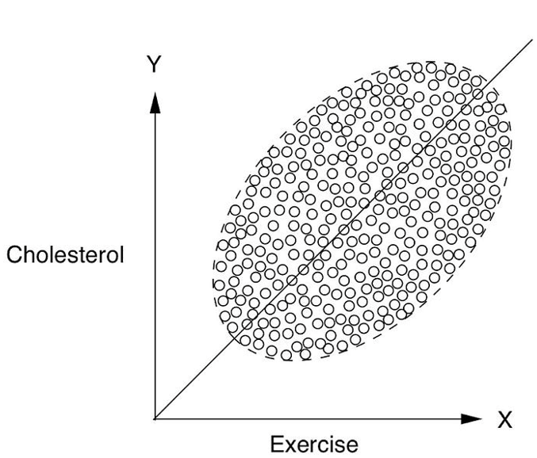
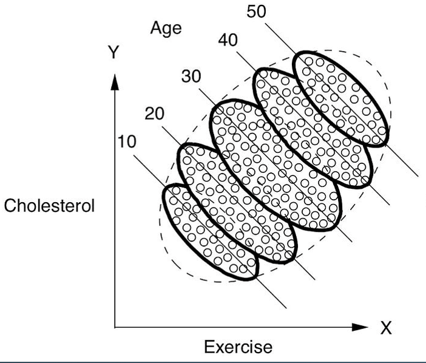
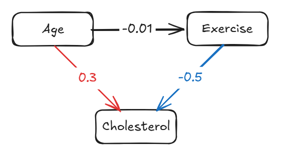
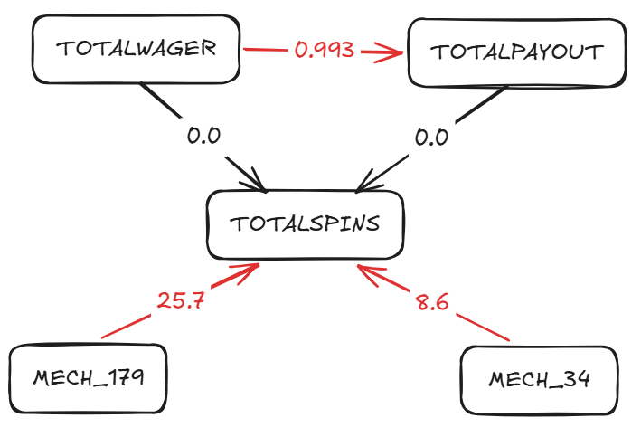

# Part 7: Causal Analysis

**Disclaimer:** Additional section added to showcase my personal area of expertise.

## Part 7.1: What is causal analysis and how does it differ from classic ML?

Simpson's paradox

Pooled together, Exercise and Cholesterol look positively correlated - more exercise, higher cholesterol:

But split the same data by Age, and the relationship inside every age band actually runs the other way - more exercise, lower cholesterol. The pooled positive trend was never real; it was Age (older people exercise more *and* have higher cholesterol in this data) confounding the picture:

The causal graph makes this explicit: Age drives both Exercise and Cholesterol, and it's only once you account for that confounding path that Exercise's true (negative) effect on Cholesterol shows up:

This is the core difference from classic ML: a predictive model would happily learn the misleading pooled correlation, because correlation is all it's optimising for. Causal analysis is about explicitly modelling *why* variables move together, so confounders like Age can be accounted for instead of mistaken for a real effect.

## Why is causal analysis useful in our world?

There are a number of different factors that can influence player behaviour. Many of these factors are often present simultaneously. It is therefor important to be able to distinguish between spurious correlations and true causal effects. 

## Player behaviour: a simple example

I have trained a very simple causal model on the given dataset. I have included only three cause-and-effect relationships. Below is the causal graph and the causal strengths.

We can see that `TOTALWAGER` has a near 1:1 causal effect on `TOTALPAYOUT`. A player can only win if they wager, so it makes sense for wagers to have this causal effect on payout. This relationships is a good way of sense checking the quality of our causal model.

Neither `TOTALPAYOUT` or `TOTALWAGER` has any causal effect on `TOTALSPINS`. In other words, how much a player wagers or wins doesn't drive how many rounds they play - the number of spins is set by something else entirely, like the specific game's mechanics or the player's own session habits, not by stake size.

I have included two random features from the dataset: `MECH_34` and `MECH_179`. Both of these features have very strong positive causal effects on `TOTALSPINS` meaning that players like these two game mechanics and it led to a high number of `TOTALSPINS`. We can also see that `MECH_179` had a stronger effect than `MECH_34`. **This level of insight into the game mechanics (i.e. does a specific game attribute really cause increased gameplay) is something that operators can truly benefit from.** If I had more time I would enrich the game-recommender and player-prediction models with a complete causal model. 